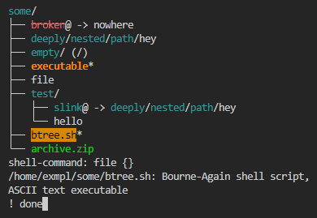

## Treest

Stateful tree view of a root directory.



### Getting Started

This project uses `cargo`:
```console
$ cargo install --path .
$ treest --help
Visually explore a file tree.

Usage: treest [OPTIONS] [PATH]

Arguments:
  [PATH]  path to open at, defaults to current directory

Options:
  -x, --clearstate           do not load any existing state for this path
  -u, --userconf <USERCONF>  use specified config instead of any existing default ($HOME/.config/treest)
      --clean                do not use any config
  -h, --help                 Print help
  -V, --version              Print version
```

### Config

When invoked, treest `:source`s the given file (with `-u`) or `$HOME/.config/treest` by default.
An example might look like:
```sh
sort extension dirs-first
filter add dotfiles
filter add file .gitignore
filter add file .ignore
bind <C-h> seq 'filter toggle dotfiles' 'filter toggle file .gitignore' 'filter toggle file .ignore'
bind <C-l> reload
```
[(see mine here)](https://github.com/naclsn/dotfiles/blob/main/.config/treest)

To see a list of existing commands use `:help`, for help on a specific command use `:help <command-name>`.
