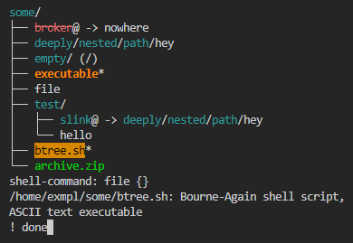

## Treest

Navigable tree view.



### Getting Started

This project uses `cargo`:
```console
$ cargo install --path .
$ treest --help
...

$ cargo r -- --help # (same without installing)
...
```

---

### TODO/wip:

* doc/help situation (`.config/treest.lua`, `require('defaults')` and `treest --lua-meta`)
* thing too long that cause terminal line wrap (render and prompt)
* subtrees (actually ll have vertical splits on other trees)

#### settings, config, ..

- provider-specific
    - [ ] sorting/filtering
    - [ ] fs: chdir to root
    - [ ] fs: .ignore
    - [ ] json: render keys as quoted strings
